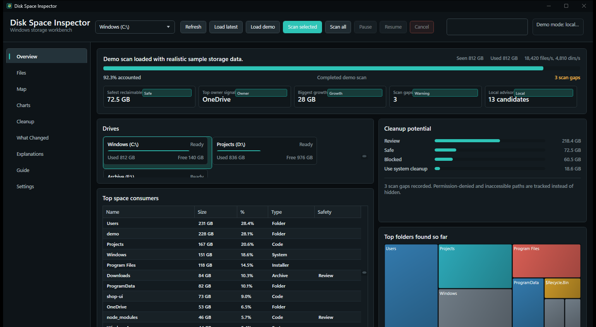
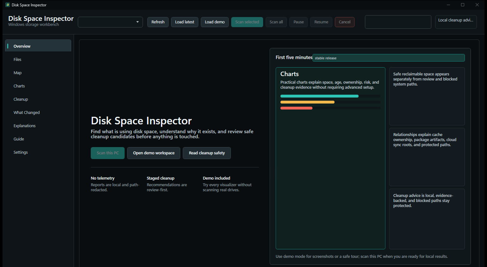
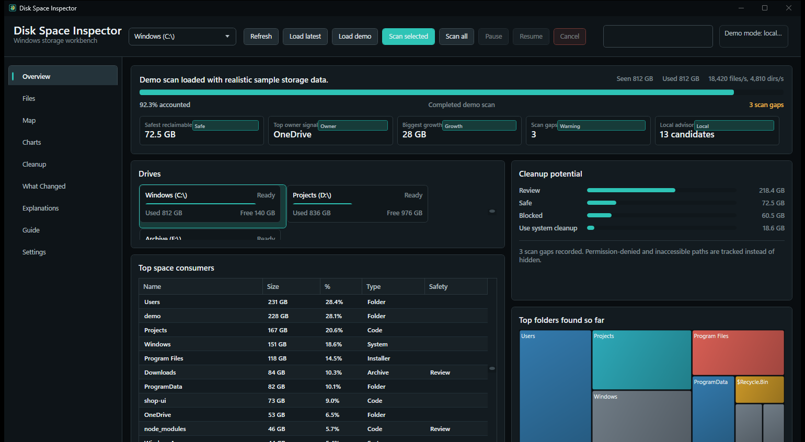
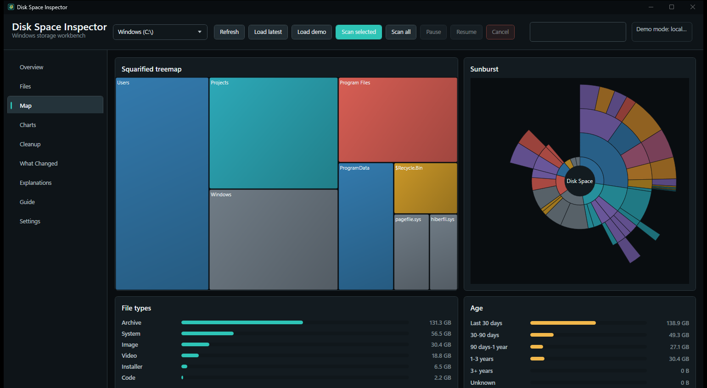
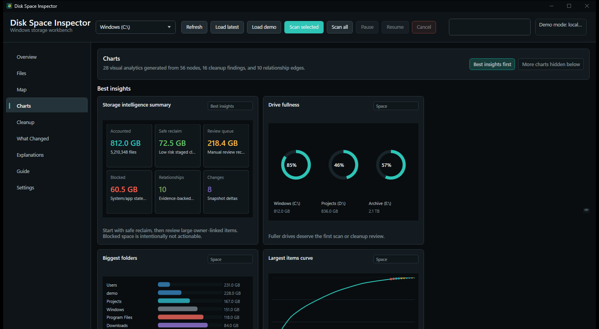
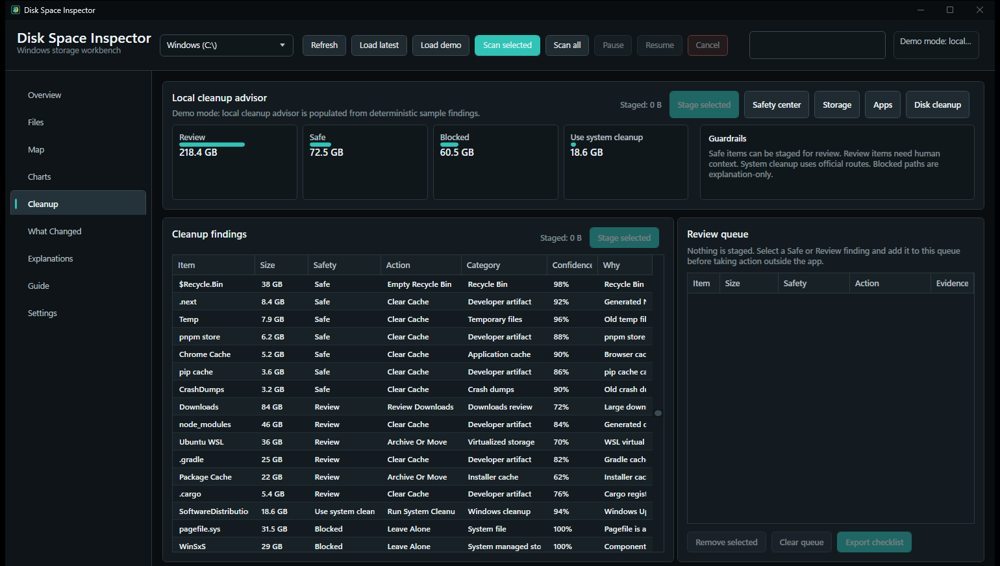
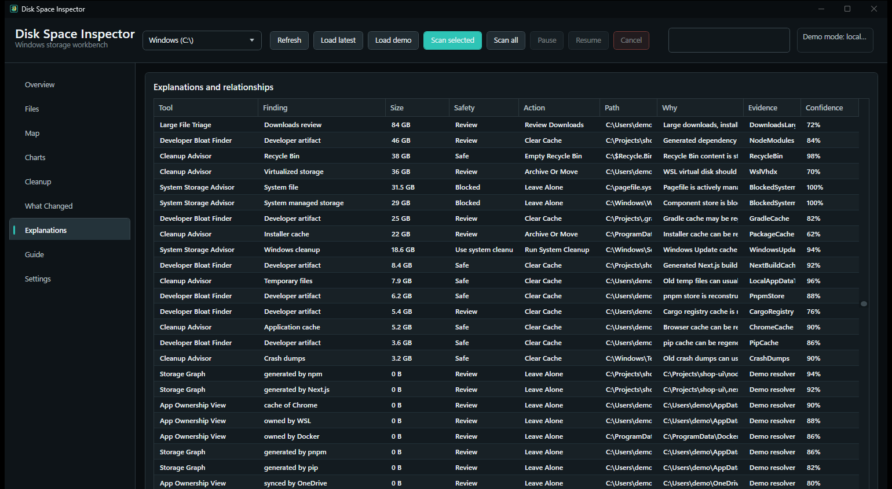
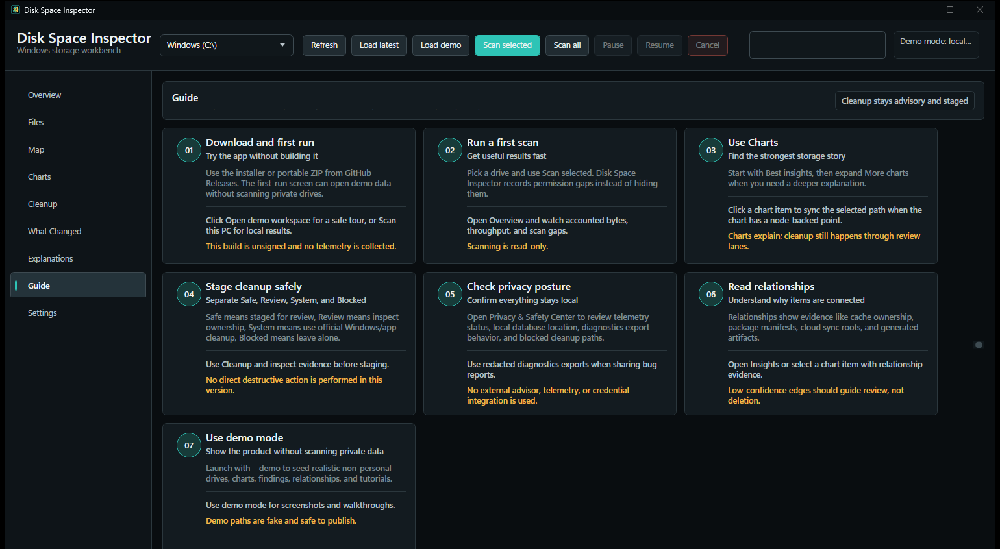
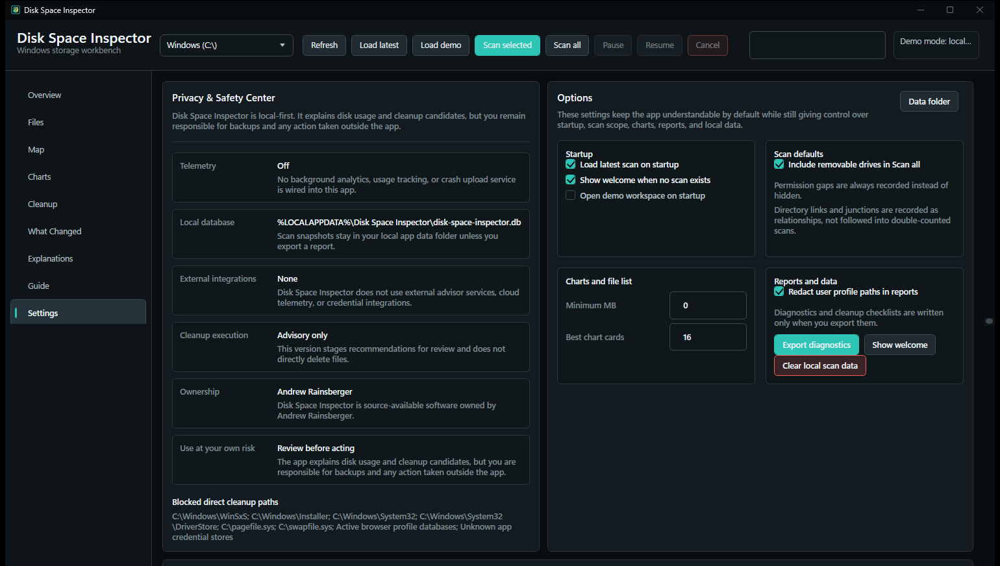

# Disk Space Inspector

Disk Space Inspector is a Windows desktop app for finding what is using disk space, understanding why it exists, and reviewing cleanup candidates safely. It scans drives, saves local snapshots in SQLite, shows maps and charts, explains app/system relationships, and keeps cleanup advisory unless a user reviews the paths themselves.



## Download

Get the latest stable Windows build from GitHub Releases:

[Download Disk Space Inspector](https://github.com/CurioCrafter/Disk-Space-Inspector/releases/latest)

- Installer: `DiskSpaceInspectorSetup-1.1.0.exe`
- Portable ZIP: `DiskSpaceInspector-1.1.0-win-x64.zip`
- Checksums: `SHA256SUMS.txt`

The build is unsigned, so Windows SmartScreen may show a reputation warning. See [download notes](docs/download.md).

## What It Does

- Scans accessible Windows drives without requiring elevation for the basic pass.
- Opens with a welcome screen and demo workspace so people can try the product without scanning real drives.
- Shows clear workspaces: Overview, Files, Map, Charts, Cleanup, What Changed, Explanations, Guide, and Settings.
- Maps disk usage with a squarified treemap, sunburst hierarchy, file type breakdowns, age histograms, and cleanup potential lanes.
- Adds 24+ chart views with practical labels for biggest folders, old files, growth, app-owned storage, developer caches, protected system areas, cloud/local storage, installer/update caches, and cleanup safety.
- Explains "What Changed" only after a baseline exists, so a first scan is not mistaken for thousands of new files.
- Stages cleanup candidates into a review queue with exact paths, evidence, action labels, and exportable checklists.
- Routes system-managed items to Windows/app cleanup tools and blocks direct cleanup of dangerous paths.
- Exports local diagnostics reports with user-profile paths redacted by default.
- Includes Settings for startup behavior, scan defaults, chart density, report privacy, local data, and safety/legal posture.

## Screenshots

















## Key Workspaces

Overview gives the fast answer: current scan progress, drive cards, safest reclaimable space, top owner signal, recent growth, scan gaps, and top folders found so far.

Files is the familiar explorer-style view. It includes shortcuts for common consumer questions like biggest folders, downloads, developer bloat, system cleanup routes, and app-owned storage.

Map shows the treemap and sunburst. Use it when you want a visual answer to "where did the space go?"

Charts turns scan data into focused storage charts. Start with Best insights, then open More charts for deeper ownership, system, developer, cloud, and risk views.

Cleanup is a local cleanup advisor. It groups findings by safety, stages only Safe/Review items into a review queue, and keeps Windows/system cleanup in official routes.

What Changed compares snapshots. The first scan becomes the baseline; later scans show new, deleted, grown, shrunk, and moved items.

Explanations shows why items are connected: app ownership, cache ownership, generated project artifacts, cloud roots, links, and other relationship evidence.

Settings includes privacy, safety, startup, scan defaults, chart options, diagnostics, local data controls, ownership, and use-at-your-own-risk language.

## Run

```powershell
dotnet run --project src\DiskSpaceInspector.App\DiskSpaceInspector.App.csproj
```

Launch with seeded demo data for screenshots or UI review:

```powershell
dotnet run --project src\DiskSpaceInspector.App\DiskSpaceInspector.App.csproj -- --demo
```

Open a screenshot-friendly page directly:

```powershell
dotnet run --project src\DiskSpaceInspector.App\DiskSpaceInspector.App.csproj -- --demo --view=charts
dotnet run --project src\DiskSpaceInspector.App\DiskSpaceInspector.App.csproj -- --demo --view=privacy
```

The app runs unelevated and records permission gaps instead of hiding them. Cleanup is staged for review only; this version does not directly delete files.

## Verify

```powershell
dotnet build DiskSpaceInspector.sln --no-restore -m:1 -v:minimal
dotnet test tests\DiskSpaceInspector.Tests\DiskSpaceInspector.Tests.csproj --no-restore -m:1 -v:minimal
```

Use `-m:1` on this machine to avoid transient project-reference file locks during WPF builds.

Create local release artifacts:

```powershell
.\scripts\package-release.ps1 -Version 1.1.0
```

The script always creates the portable ZIP. It also creates the installer when Inno Setup 6 is installed locally; GitHub Actions installs Inno Setup automatically for release builds.

## Tutorials

- [Download and first run](docs/tutorials/download-and-first-run.md)
- [First scan](docs/tutorials/first-scan.md)
- [Charts](docs/tutorials/visual-lab.md)
- [Cleanup safety](docs/tutorials/cleanup-safety.md)

## License

Disk Space Inspector is not MIT licensed. It is owned by Andrew Rainsberger and released under the custom Disk Space Inspector Source-Available Use License 1.1 in `LICENSE`.

In short: people may download, inspect, run, and use Disk Space Inspector, but they do not own it and may not claim ownership, relicense it, sell it, or distribute modified versions without Andrew Rainsberger's written permission.

Use at your own risk. Disk Space Inspector explains local storage and cleanup candidates, but users are responsible for reviewing paths, understanding consequences, and backing up important files before taking cleanup action.
